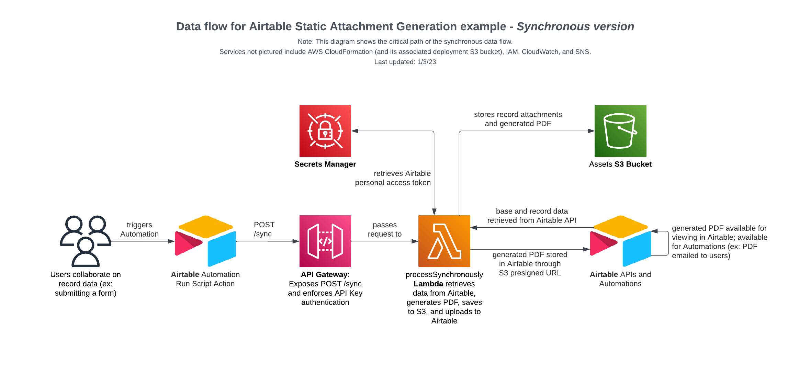
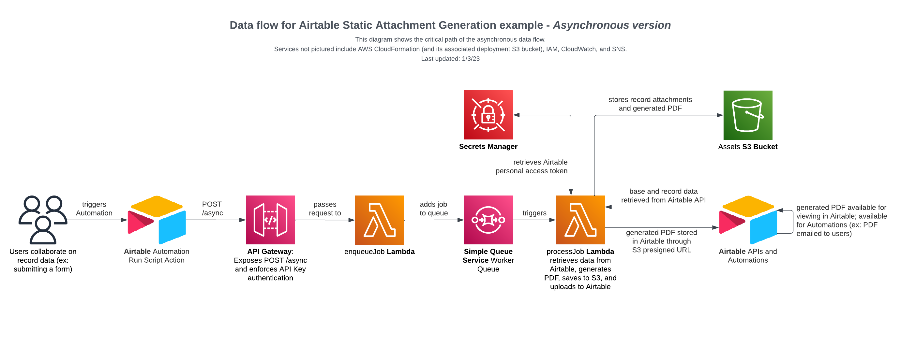

# Static PDF Generator from Airtable Records

This repository contains a [Serverless Framework](https://www.serverless.com/framework/docs) example that generates a static document (PDF) from data stored in Airtable and saves the generated document to S3 and back to an Airtable attachment field. 

A forty second demo video can be found [here](docs/user_demo_silent.mp4).

---

The software made available from this repository is not supported by Formagrid Inc (Airtable) or part of the Airtable Service. It is made available on an "as is" basis and provided without express or implied warranties of any kind.

---


## Functionality and Architecture

### High level overview (10,000 ft view)

Once deployed, this Serverless Framework example will generate a PDF based on the contents of a record in Airtable (based on the fields visible in the specified view) and then save the generated PDF to both S3 and in the specified Airtable field. An Airtable Automation can then be used to email the generated PDF to users so they can access the PDF from within their email client.

The codebase includes both a synchronous and an asynchronous data flow. Both flows have nearly identical outcomes.

**The synchronous flow** (`processSynchronously` Lambda function) accepts an API request and will generate the PDF, save it to S3, upload it to the Airtable record, and a temporary (AWS S3 presigned URL) as the API response (after all of the previous steps have completed successfully).

This flow is best for iterative local testing and is generally easier to debug since there are fewer moving pieces. The main disadvantage is that all of the logic must complete within API Gateway's maximum request timeout which is 30 seconds.

[](./docs/sync-data-flow.png)

**The asynchronous flow** (`enqueueJob` and `processJob` Lambda functions) where `enqueueJob` accepts the request for PDF generation and returns a successful status almost immediately, noting that the job has been received. Shortly thereafter, the `processJob` picks up the job from the queue and generates the PDF, uploads it to AWS S3, and updates the Airtable record.

This flow is best for production use cases and is detailed further in the documentation below. The timeout for the `processJob` Lambda function is configured to be two minutes (compared to the absolute maximum of 30 seconds for the synchronous flow) and can be increased up to Lambda's maximum runtime (15 minutes) in [`serverless.yml`](./serverless.yml).

[](./docs/async-data-flow.png)


### AWS resources created

Once deployed, the following resources will be created in AWS for you. `Monospaced text` denotes resource names/identifiers in the [`serverless.yml`](./serverless.yml) file.

* Application logic resources
  * Lambda function `processSynchronously` which is triggered by an API key authenticated POST request to the API Gateway's `/sync` resource and will _synchronously_ process the PDF generation request, which may lead to time outs and is not recommended for production use.
  * Lambda function `enqueueJob` which is triggered by an API key authenticated POST request to the API Gateway's `/async` resource and will submit the request to the SQS queue `WorkerQueue` to be processed by the `processJob` Lambda function
  * Lambda function `enqueueJob` which accepts one job from the `WorkerQueue` at a time and performs the PDF generation logic.
  * All three Lambda functions have CloudWatch logs retained for 14 days and [Lambda Insights](https://docs.aws.amazon.com/AmazonCloudWatch/latest/monitoring/Lambda-Insights.html) enabled.  
* Supporting resources
  * S3 bucket [used by the Serverless Framework for deploying](https://www.serverless.com/framework/docs/providers/aws/guide/deploying)
  * S3 bucket `S3BucketForAssets` used by the application to store generated PDFs and assets (such as attachments to the record a PDF is being generated for)
  * API Gateway with a usage plan and single API key
  * SQS queue `WorkerQueue` which has jobs enqueued for it by the `enqueueJob` Lambda function. The jobs are later processed by the `processJob` Lambda function.
  * SQS queue `DeadLetterQueue` which acts as a [dead letter queue](https://aws.amazon.com/sqs/faqs/#Dead-letter_queues) for the `WorkerQueue` queue and all Lambda functions.
  * Cloudwatch alarm and associated SNS topic/subscription for `$MY_WORK_EMAIL` to be notified when a new message is received by the `DeadLetterQueue` (which indicates a failure)
  * Secrets manager secret `SecretAirtableApiKey` which comes with a default value and should be replaced with an Airtable Personal Access Token (part of the setup instructions). This secret is retrieved via Lambda function IAM role authentication at Lambda start up.
  * IAM Role shared by all three Lambda functions which has access to create and write to log streams, upload and retrieve objects from the `S3BucketForAssets` bucket, interact with the `WorkerQueue`, and retrieve the secret value of `SecretAirtableApiKey`. 

Note: The list above is not meant to be exhaustive. Please refer to the `serverless.yml` file and CloudFormation resources tab for a complete list.

### Asynchronous data flow details (1,000 foot view)

In this section, we will walk through the process a request goes through -- from the Airtable Run Script Action being triggered through the Airtable record being updated with the generated PDF.

#### 1. Airtable Automation triggers a run script action to call `async` endpoint
In the setup instructions below, you'll be guided through the deployment and setup of this example code base. You'll end with an Airtable Automation that sends an HTTP request that looks like the following [curl](https://developer.ibm.com/articles/what-is-curl-command/) command to the AWS API Gateway:

```sh
curl "https://YOUR_API_GATEWAY_ENDPOINT.execute-api.us-east-1.amazonaws.com/dev/async" \
  --request POST \
  --header "Content-Type: application/json" \
  --header "X-Api-Key: YOUR_API_GATEWAY_API_KEY" \
  --data '{ "baseId": "appXXX",
            "tableId": "tblXXX",
            "recordId": "recXXX",
            "targetAttachmentFieldNameOrId": "fldXXX",
            "viewId": "viwXXX"
          }'
```

#### 2. Request received and job enqueued

AWS API Gateway validates the `X-Api-Key` in the request and passes the request payload and other metadata to the `enqueueJob` Lambda function. The `enqueueJob` Lambda function, whose logic is in [`async/enqueueJob.js`](./async/enqueueJob.js), performs some light validation of the request payload and sends a message to the SQS queue with the details of the job to be done.

Key resources: AWS API Gateway; AWS Lambda function

#### 3. Job processed (PDF generated, Airtable record updated)

Once a new job has been added to the queue, the `processJob` Lambda function, whose logic is in [`async/processJob.js`](./async/processJob.js), is executed. This is where most of the work occurs, including:
- Airtable API key is retrieved from AWS Secrets Manager
- The full record and relevant base/table/view definitions are retrieved from the Airtable API
- The static asset (PDF in this case) is generated using the logic in [`shared/generateSingleRecordPdf.js`](./shared/generateSingleRecordPdf.js). You will most likely want to customize this portion of code. It currently:
  - Determines which fields are considered visible based on the fields visible in the grid view specified by `viewId`
  - Uses the primary field of the table as the  title (large text at the top) of the page and links to the record right below the title.
  - Creates a table (with field name and field value columns) of the remaining fields that have non-empty string (text) or numeric values.
  - For each of the attachment fields present in the specified view, the attachments are replicated to AWS S3 **as publicly viewable*** and linked to in the body of the generated PDF. If the attachment appears to be a PNG or JPEG image, a preview of the image is embedded in the PDF.
  - \* in order to let viewers of the PDF who are not logged in to Airtable or AWS to be able to click the link and view the attachment without needing to log in.
- The static asset is uploaded to S3 as a private file
- A [presigned URL](https://docs.aws.amazon.com/AmazonS3/latest/userguide/ShareObjectPreSignedURL.html), valid for 10 minutes, is generated
- The static asset is added to the Airtable record by specifying  the presigned URL as the value for the target attachment field to the Airtable update record API.


## Setup instructions

📚 Step-by-step instructions are available in [`docs/STEP_BY_STEP.md`](./docs/STEP_BY_STEP.md)

## Areas of potential improvement

- Additional generation examples:
  - Generate a PDF with the contents of a grid view (one row in table = one record)
  - Generate other types of static documents:
    - Powerpoint slide(s) - likely using [PptxGenJS](https://github.com/gitbrent/PptxGenJS)
    - MS Word / Google Sheets / Markdown
- Testing -  documented test script and automated testing including unit and integration tests

## Acknowledgements 
- [@onehungrymind's](https://github.com/onehungrymind) [Serverless PDFKit example](https://github.com/onehungrymind/egghead-function-to-endpoint/tree/master/egghead-pdf-generator)
- [@alexdebrie's](https://github.com/alexdebrie) [Using SQS with AWS Lambda and Serverless blog post](https://www.serverless.com/blog/aws-lambda-sqs-serverless-integration/)
- [@FidelLimited's](https://github.com/FidelLimited) [How To Set-Up SQS Dead-Letter Queues With Alarm Notifications blog post](https://fidelapi.com/blog/how-to-set-up-sqs-dead-letter-queues-with-alarm-notifications/)